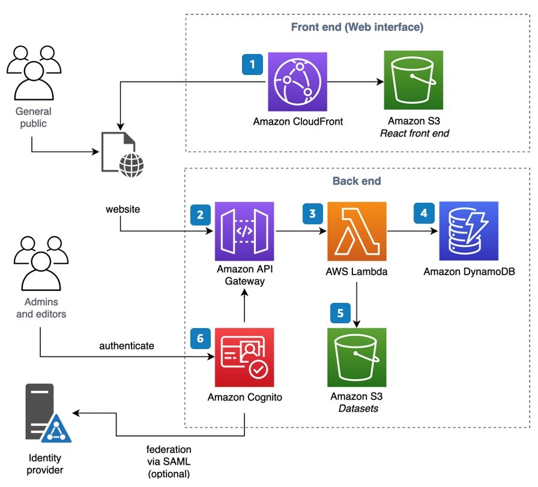

# ⛅ [Hands-on] Building Scalable Cloud-Native FullStack Serverless Applications ⚡

> 🎯 A Real-World Guide to Building Production-Ready Serverless Web Application ⚡

**Building Scalable Cloud-Native Serverless Applications** is on-the-job training tech-series to help Customers build the right developer skills for cloud adoption, and build developer cloud-native fluency across their organization.

[Building Scalable Cloud-Native Serverless Applications](https://) to build modern cloud-native applications that are designed and distributed for scale and agility 🎯🚀

* [x] 🌥 Would you like to build cloud-native applications and serverless architecture practices? 
* [x] 🎯 Do you have the skills needed to build modern cloud applications that are designed and distributed for scale and agility? 
* [x] 🚀 Please join us for our FREE continuous hands-on training series: Building Scalable Cloud-Native Serverless Applications 

## 🚦 Prerequisites 🌥

* [x] **AWS Account**: using [AWS Free Tier](https://aws.amazon.com/free) or [AWS Workshop Portal](https://cdk.job4u.io/en/setup/aws-account.html)
* [ ] [Manually] [AWS CloudShell](https://cdk.job4u.io/en/setup/cloud9-ide.html)
* [ ] [Automatically] [GitHub Action]()

## 💎 Business Case 💰

* [ ] TODO

## ⚡ Serverless Architecture for Web Application 🌏

  

## Building MicroServices Serverless Applications

| #  | Step                  | Resources                                   |
|--  | --------------------- | ------------------------------------------- |
| 1. | [Setup - Installation](docs/installation.md)         | [CDK] Deploy Serverless Application and setup for usage |
| 2. | [Setup - Customize Frontend](docs/custom-config.md)  | [ReactJS] Customize information on the Frontend such as the brand, contact information, topic area label |
| 3. | [Setup - Customize Backend](docs/custom-backend.md)  | [NodeJS] Customize information on the Backend |
| 4. | [Setup - Data Ingestion API](docs/api.md)            | [Postman] How to use the Data Ingestion API |
| 5. | [Setup - User Guide](docs/User-Guide.docx)           | [MkDocs] How to use the Serverless Application |
| 6. | [Operations - Runbook](docs/runbook.md)              | [MkDocs] Logging, monitoring, and alerting on issues |
| 7. | [Operations - Scaling](docs/scalability.md)          | [MkDocs] How to scale Serverless Application |
| 8. | [Security - Shared Responsibility](docs/security.md) | [MkDocs] Securing Serverless Application is a shared responsibility between AWS and the Customer |
| 9. | [Security - IP Blocking](docs/on-prem-access.md)     | [MkDocs] Limit access to come from an IP range (e.g. on-premises network) |

