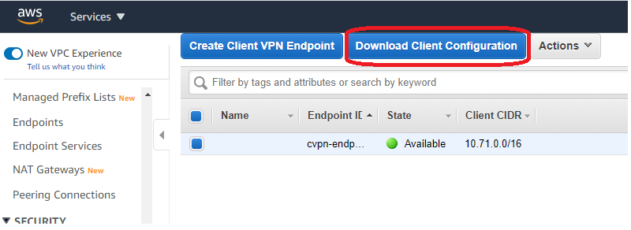
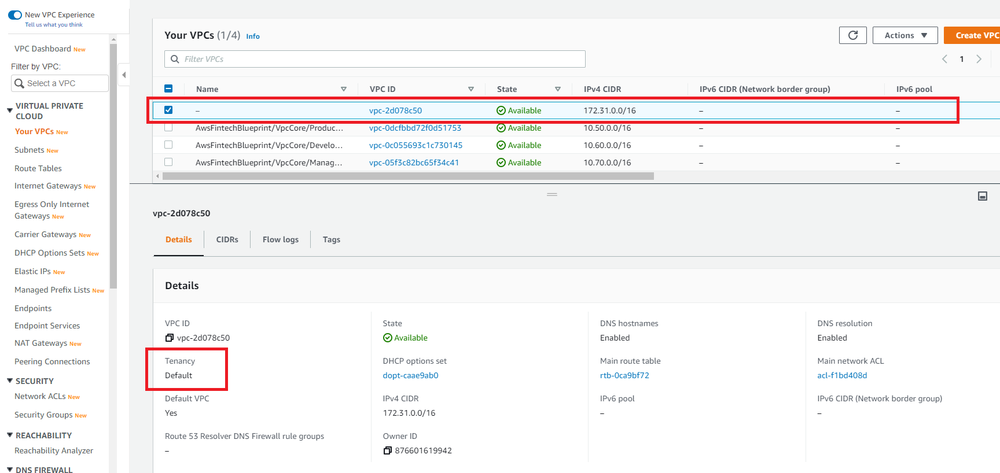
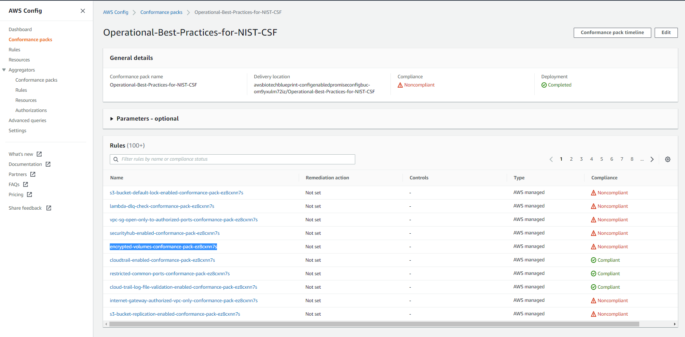
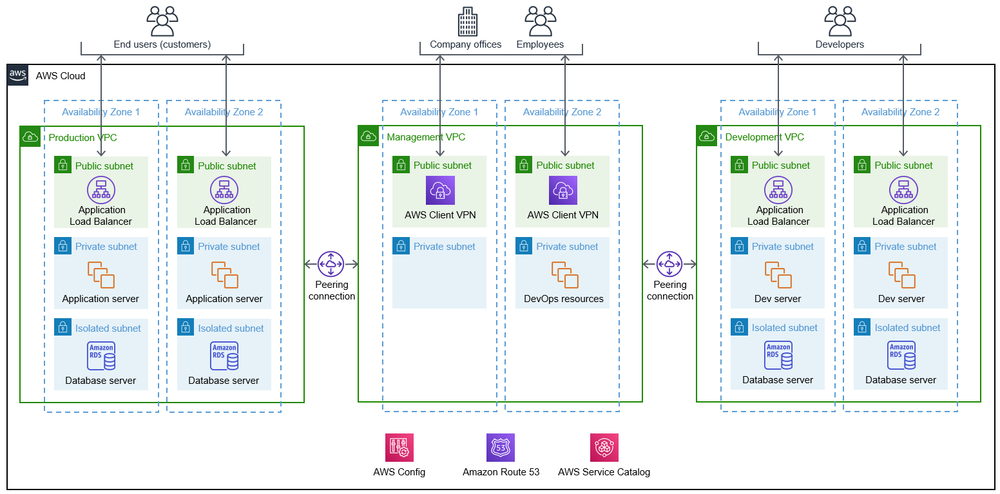
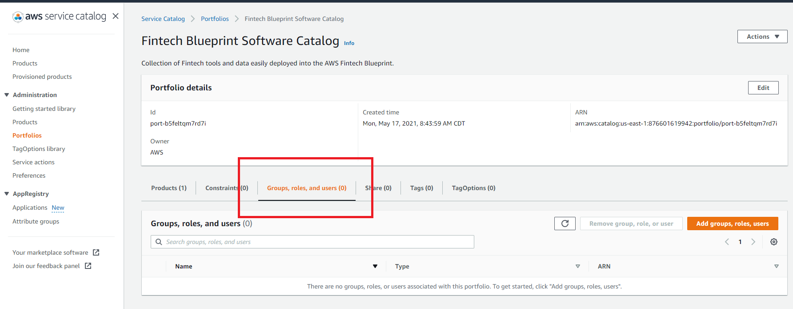
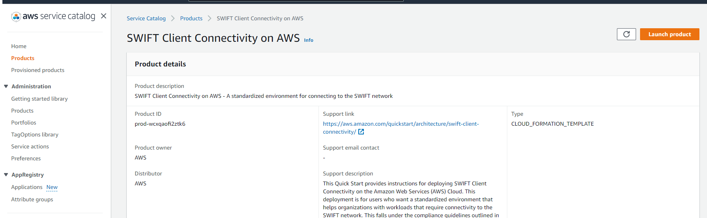
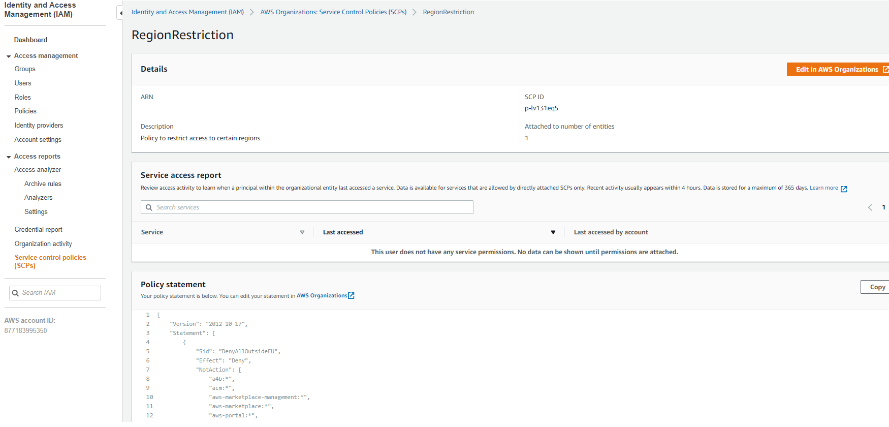

// Add steps as necessary for accessing the software, post-configuration, and testing. Don’t include full usage instructions for your software, but add links to your product documentation for that information.
//Should any sections not be applicable, remove them

//== Test the deployment
// If steps are required to test the deployment, add them here. If not, remove the heading

:xrefstyle: short

== Post-deployment steps

=== Connect to the VPN

After the deployment is complete, you connect to the VPN to route into the private subnets in the VPCs. The {partner-product-name} Quick Start deploys an AWS Client VPN endpoint in the management VPC. The management VPC, which sends NAT traffic over peering connections into the production and development VPCs, acts as a hub for networking into those VPCs. The development and production VPCs do not communicate with each other, as shown in <<vpn1>>.

[#vpn1]
.VPN routing rules in the {partner-product-short-name} Quick Start
[link=VPNRoutingDiagram.png]
image::../images/VPNRoutingDiagram.png[VPN, 60%]

. Navigate to the Amazon Virtual Private Cloud (Amazon VPC) web console, and go to the https://console.aws.amazon.com/vpc/home?#ClientVPNEndpoints:sort=clientVpnEndpointId[AWS Client VPN endpoint section^]. 

. Select the AWS Client VPN endpoint listed, and choose *Download Client Configuration*, as shown in <<VPNConfig>>. Your browser downloads the file *client-config.ovpn*.
+
[#VPNConfig]
.Downloading the client-configuration file
[link=downloadclientconfig.png]

+
. Navigate to the Amazon S3 console, and open the bucket prefixed *awsstartupblueprintstack-clientvpnvpnconfigbucket*. Five files are listed. Download *client1.domain.tld.key* and *client1.domain.tld.crt*. The other three files are the certificate authority (CA) chain and server key/certificate. You need those later if you create additional client certificates.

. Open the downloaded file *client-config.ovpn* in a text editor.

. Add the following lines to the bottom of the file. Replace the *<cert>* and *<key>* sections with the contents of the two files.
+
```
<cert>
Contents of client certificate (client1.domain.tld.crt) file
</cert>

<key>
Contents of private key (client1.domain.tld.key) file
</key>
```
+
. Save *client-config.ovpn*. You should be able to open or import that file with any OpenVPN client. 

AWS offers is own lightweight VPN client that works on most operating systems. For installation and usage instructions, see https://docs.aws.amazon.com/vpn/latest/clientvpn-user/connect-aws-client-vpn-connect.html[Connect using an AWS provided client^].

For usage instructions for other https://openvpn.net/download-open-vpn/[OpenVPN clients^], see https://docs.aws.amazon.com/vpn/latest/clientvpn-user/connect.html[Connect using an OpenVPN client^].

TIP: If you get an error trying to connect about resolving the Client VPN endpoint's DNS name or hostname, you may need to edit the .ovpn file. For more information, see https://docs.aws.amazon.com/vpn/latest/clientvpn-admin/troubleshooting.html#resolve-host-name[Unable to resolve Client VPN endpoint DNS name].

=== (Optional) Modify the default configurations

After deploying the Quick Start, you may want to change some of the default configurations. For example, the default internal DNS apex is the generic top-level domain .corp instead of yourcompany.com. To change the DNS apex or any configuration you see in the code, make the change, build the project, and run `cdk deploy`. The CDK automatically figures out the necessary AWS CloudFormation change set and applies only the changes you've made.

For example, you can open the file *lib/aws-startup-blueprint-stack.ts* and update the DNS construct to use *yourcompany.com* instead of *.corp*, as shown here:
    
    new Dns(this,'Dns', {
      ... ,
      TopLevelDomain: "yourcompany.com"      
    });

To apply that change, build and deploy as you did before:

  npm run build && cdk deploy

The CDK automatically creates and applies an AWS CloudFormation change set. This change set creates a new https://docs.aws.amazon.com/Route53/latest/DeveloperGuide/hosted-zones-private.html[private Route 53 hosted zone^], attaches it to all the VPCs, and deletes the previous hosted zone in a few minutes. Updates take less time than the initial deployment because you only update resources that you've changed in the code. 

=== (Recommended) Delete the default VPC

Every new account created in AWS comes with a default VPC, such as the one highlighted in <<DeleteDefaultVPC>>. This VPC is listed in the VPC console along with the production, management, and development VPCs created by this Quick Start. 

[#DeleteDefaultVPC]
.Deleting the default VPC
[link=images/defaultvpc_0.png]


The default VPC has public subnets in every Availability Zone. It is a fundamentally insecure VPC. Do not use it. 

TIP: If you have a new account and have never launched anything into the default VPC, delete the default VPC and use only the VPCs created by the Quick Start. If you've already launched resources into the default VPC, migrate them to the VPCs created by the Quick Start, and then delete the default VPC. By deleting the default VPC, you reduce the chances of a user launching a resource into an exposed public subnet. 


//== Test the deployment
// If steps are required to test the deployment, add them here. If not, remove the heading


//== Best practices for using {partner-product-short-name} on AWS
// Provide post-deployment best practices for using the technology on AWS, including considerations such as migrating data, backups, ensuring high performance, high availability, etc. Link to software documentation for detailed information.

//_Add any best practices for using the software._

== Security and compliance
// Provide post-deployment best practices for using the technology on AWS, including considerations such as migrating data, backups, ensuring high performance, high availability, etc. Link to software documentation for detailed information.

For automatic alerting when resources may have been deployed insecurely, AWS Config https://docs.aws.amazon.com/config/latest/developerguide/conformance-packs.html[conformance packs^] provide a general-purpose compliance framework. You can use them to create security, operational, or cost-optimization governance checks. You can use managed or custom AWS Config rules and AWS Config remediation actions. 

WARNING: AWS Config conformance packs, as sample templates, do not ensure compliance with any specific governance or compliance standard. You are responsible for making your own assessment as to whether your use of the services meets applicable legal and regulatory requirements.

This Quick Start deploys the following conformance packs:

* https://docs.aws.amazon.com/config/latest/developerguide/operational-best-practices-for-pci-dss.html[Operational Best Practices for Payment Card Industry Data Security Standard (PCI DSS) 3.2.1^]
* https://docs.aws.amazon.com/config/latest/developerguide/operational-best-practices-for-aws-identity-and-access-management.html[Operational Best Practices for AWS Identity and Access Management (IAM)^]
* https://docs.aws.amazon.com/config/latest/developerguide/operational-best-practices-for-amazon-s3.html[Operational Best Practices for Amazon S3^]
* https://docs.aws.amazon.com/config/latest/developerguide/operational-best-practices-for-nist-csf.html[Operational Best Practices for National Institute of Standards and Technology (NIST) Cybersecurity Framework (CSF)^]
* https://docs.aws.amazon.com/config/latest/developerguide/aws-control-tower-detective-guardrails.html[AWS Control Tower Detective Guardrails^]

These conformance packs create AWS Config rules that regularly evaluate resources in your AWS account against security best practices. When AWS Config finds an offending resource, it flags that resource for your review in the AWS Config console. AWS Config also scans resources created in your account before deploying the Quick Start.

For example, the Operational Best Practices for NIST CSF conformance pack comes with 93 rules. One of those rules—*encrypted-volumes-conformance-pack*, highlighted in <<conformance_pack0>>—checks whether attached Amazon Elastic Block Store (Amazon EBS) volumes are encrypted. 

[#conformance_pack0]
.Rules listed in the Operational Best Practices for the NIST CSF conformance pack
[link=images/conformancepacks_0.png]


Choosing the rule *encrypted-volumes-conformance-pack* on this screen would display details related to that rule, as shown in <<conformance_pack1>>. 

[#conformance_pack1]
.Details related to the encrypted-volumes rule
[link=images/conformancepacks_1.png]
image::../images/conformancepacks_1.png[Conformance packs1]

You can update the AWS Config delivery channel to include an Amazon Simple Notification Service (Amazon SNS) topic to send email or text notifications when resources are flagged. You might also include more sophisticated approaches: regularly reviewing AWS Config reports, using AWS Config's automatic remediation capabilities, or integrating AWS Config with security ticketing or security event and incident management (SEIM) practices. 

=== Conformance pack: Operational Best Practices for PCI DSS 3.2.1

While payment card industry (PCI) might not be a concern for every user of this Quick Start, many companies store, transmit, or process payment data. So even if you have no PCI requirements, consider implementing the PCI security conformance pack. This pack has over 140 rules that capture a number of best practices.

If you do have PCI needs, read https://docs.aws.amazon.com/config/latest/developerguide/operational-best-practices-for-pci-dss.html[Operational Best Practices for PCI DSS 3.2.1^]. For every AWS Config rule included in a conformance pack, there's a corresponding PCI control ID along with AWS guidance for each check. This conformance pack was validated by https://aws.amazon.com/professional-services/security-assurance-services/[AWS Security Assurance Services LLC^]. This is a team of PCI Qualified Security Assessors (QSAs), HITRUST certified common security framework practitioners (CCSFPs), and compliance professionals who are certified to provide guidance and assessments for various industries.
       
== Other useful information
//Provide any other information of interest to users, especially focusing on areas where AWS or cloud usage differs from on-premises usage.

=== Where to go from here?
After you are connected to the VPN, you essentially have a private encrypted channel into your new VPCs. You can connect to any resources that you launch into your VPCs using private IP addresses without using insecure (public) bastion hosts. 

<<architecture2>> shows examples of the sorts of resources you might deploy into your VPCs and subnets. If you aren't sure which VPC or subnets you should deploy resources into, see the link:#_faq[FAQ] section for guidance and more examples. 

[#architecture2]
.{partner-product-short-name} architecture with example resources deployed


=== (Optional) Set up DNS
The Quick Start sets up a private DNS with .corp as the default apex domain using https://console.aws.amazon.com/route53/v2/home#Dashboard[Amazon Route 53 in your account^]. Using the Amazon Route 53 console, you can create private A or CNAME records to any private resources you create. 

For example, you may decide to launch a development server that gets a private IP, such as 10.60.0.198. Instead of having to remember that IP, you can create an A record in the .corp Route 53 hosted zone for *pauls-machine.corp* to the private IP 10.60.0.198. Resources in all three VPCs and clients connected to the AWS Client VPN endpoint then can all resolve *pauls-machine.corp* from a browser, terminal, API call, etc.

=== (Optional) Set up permissions for the AWS Service Catalog

You can deploy fintech tools into the {partner-product-name} environment from the AWS Service Catalog. The AWS Service Catalog requires that you give permissions to individual IAM users, groups, and roles to launch products from an AWS Service Catalog portfolio. To grant that permission, follow these steps:

. Navigate to the https://console.aws.amazon.com/servicecatalog/home?#portfolios?activeTab=localAdminPortfolios[AWS Service Catalog console^]. 

. Choose *Startup Blueprint Software Catalog* portfolio. 

. Choose the *Groups, roles, and users* tab, as shown in <<SCPermission>>. 
+
[#SCPermission]
.Granting permissions to groups, users, and roles
[link=images/service-catalog-permission.png]

+
. Choose the *Add groups, users, and roles* button.

. Select the IAM users, groups, or roles that you want grant permissions to. If you need permissions, include yourself.
+
Anyone you've added can visit the https://us-east-1.console.aws.amazon.com/servicecatalog/home?isSceuc=true&region=us-east-1#/products[products list section of the AWS Service Catalog console^], and deploy any of the tools listed. For example, you or another user could deploy the SWIFT Client Connectivity Quick Start, as shown in <<SwiftQS>>. For details, see the following section of this guide.
+
[#SwiftQS]
.SWIFT Client Connectivity Quick Start in the AWS Service Catalog
[link=images/swiftservicecatalog.png]


=== (Optional) Deploy the SWIFT Client Connectivity Quick Start

The SWIFT Client Connectivity Quick Start is a standardized environment for connecting to the SWIFT network. You can deploy the Quick Start into your AWS account from the AWS Service Catalog (as described in the previous section), from the links on the Quick Start's https://fwd.aws/4bpjr?[webpage^], or from the links in its https://fwd.aws/agK6R?[deployment guide^]. 

When you deploy this Quick Start from the AWS Service Catalog, a continuous integration and continuous delivery (CI/CD) pipeline automatically deploys it in about 25 minutes. You can observe the progress in the AWS CodePipeline console, as shown in <<SwiftQSCodePipeline>>. 

[#SwiftQSCodePipeline]
.Deploying the SWIFT Client Connectivity Quick Start through AWS Service Catalog
[link=images/swift_codepipeline.png]
image::../images/swift_codepipeline.png[SwiftQSCodePipeline]

=== (Optional) Restrict IAM actions to specific AWS Regions 

You can restrict IAM actions to EU or US AWS Regions. For example, you may want to restrict the creation of Amazon Elastic Compute Cloud (Amazon EC2) instances or S3 buckets to only European Regions. You might do this for compliance reasons or because it's a good practice to keep resources out of Regions that you don't intend to use. 

If you have a single AWS account, enforce AWS Region restrictions by creating https://docs.aws.amazon.com/IAM/latest/UserGuide/access_policies_boundaries.html[permissions boundaries for IAM entities^]. Permissions boundaries restrict IAM actions to the AWS Regions that you specify. To create permissions boundaries, configure the `RegionRestriction` class in *lib/aws-startup-blueprint-stack.ts*. Example:

```typescript
      new RegionRestriction(this, 'RegionRestriction', {
        AllowedRegions: ["eu-central-1","eu-west-1","eu-west-3", "eu-south-1", "eu-north-1"]
      });  
```

The *cdk.json* file contains the helper context variables `apply_EU_RegionRestriction` and `apply_US_RegionRestriction`. To apply the Region restriction, set one of those variables to `true`, and run `cdk deploy` again.

For a permissions boundary to have any effect, it must be attached to all existing and future IAM users and roles. Therefore, the `RegionRestriction` class creates an AWS Config rule to detect and remediate any missing IAM permissions boundaries. To use this rule, navigate to the AWS Config console, and choose the *AwsStartupBlueprint-RegionRestriction* rule, as shown in <<RegionRestriction>>.

[#RegionRestriction]
.Region restriction rule
[link=images/regionrestriction_config0.png]
image::../images/regionrestriction_config0.png[RegionRestriction]

This AWS Config rule evaluates your IAM users and roles and lists their compliance status. To remediate a noncompliant resource, select the resource and choose *Remediate*, shown in <<RegionRestrictionRemediation>>. The service control policy is applied, and that user or role can no longer perform any action outside of the specified Region. 

[#RegionRestrictionRemediation]
.Remediating the user's permissions to the desired Regions
[link=images/regionrestriction_config1.png]
image::../images/regionrestriction_config1.png[RegionRestrictionRemediation]

After the remediation is complete, AWS CloudTrail invokes the AWS Config rule. CloudTrail tells AWS Config that the IAM principal has been updated and that it's time to re-evaluate the resource. This takes about 15 minutes. Because the boundary has been applied, the re-evaluation reports the role or user as compliant.

==== Enable automatic remediation

WARNING: Enabling automatic remediation impacts existing IAM users and roles that were not created by the Quick Start.

This Quick Start sets the remediation configuration to *Manual* instead of *Automatic* in case you have existing IAM users or roles. Automatically applying the remediation and attaching the permissions boundaries has an impact on existing IAM principals' permissions. Before applying the boundary, verify whether any of the flagged IAM principals depend on any nonapproved Regions. If you are working in a new account or are unconcerned about the impact on existing IAM principals, you can turn on automatic remediation as follows: 

. In the AWS Config console, go to the *Remediation action* section of the *AwsStartupBlueprint-RegionRestriction* AWS Config rule. 

. Choose *Edit*, as shown in <<RegionRestrictionRemediationEditAuto>>:
+
[#RegionRestrictionRemediationEditAuto]
.Editing the remediation action
[link=images/regionrestriction_config2.png]
image::../images/regionrestriction_config2.png[RegionRestrictionRemediationEditAuto]
+
. Choose *Automatic remediation*.
. Choose *Save changes*.

==== Restrict the AWS Region in multi-account configurations

In a multi-account setup, service control polices (SCPs) are superior to permissions boundaries. SCPs are applied across an entire account and do not need to be individually attached to IAM principals. However, if you have only one account, use permissions boundaries to restrict Regions, as discussed earlier. SCPs apply only to subaccounts. When you create a new account, the Region-restricting SCP created in this architecture will be applied automatically to any new account you create.

For more information, see the https://console.aws.amazon.com/iam/home?organizations/ServiceControlPolicies/#/organizations/ServiceControlPolicies[service control policies^] in the IAM console, as shown in <<SCP>>.

[#SCP]
.The service control policy that restricts actions in subaccounts when you create them
[link=images/regionrestriction_config4.png]
 
