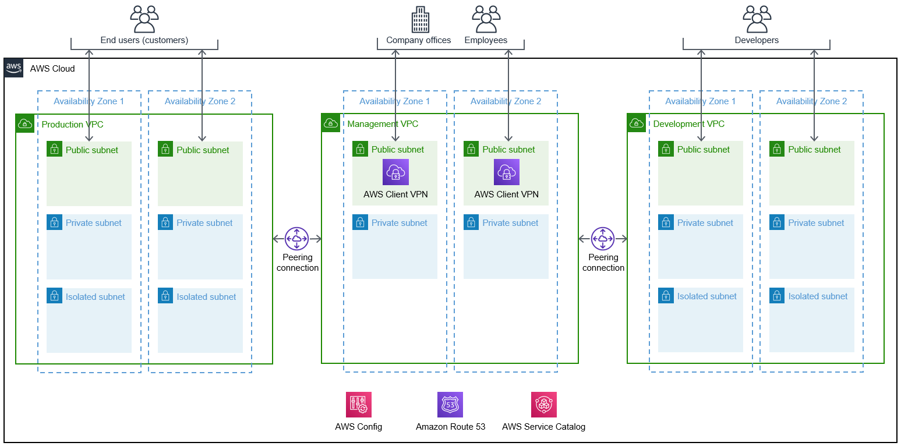

:xrefstyle: short

Deploying this Quick Start for a new virtual private cloud (VPC) with default parameters builds the following environment in the AWS Cloud. 

[#architecture1]
.Quick Start architecture for {partner-product-short-name} on AWS

As shown in <<architecture1>>, the Quick Start sets up the following:

* A highly available architecture with three VPCs, each spanning two Availability Zones. The VPCs contain public and private subnets according to AWS best practices, to provide you with your own virtual networks on AWS. The isolated subnets are for sensitive resources, such as databases that should be addressable only by your internal networks and need no outbound internet access.

** A production VPC into which you can deploy public and internal applications. 

** A management VPC with AWS Client VPN endpoints in the public subnets. This VPC helps secure connectivity to your VPCs. Your company's employees use this VPC to access your private cloud resources.

** A development VPC for your developers to build and test your products. 

* Peering connections so that you can connect using Secure Shell (SSH) and remote desktop access from the management VPC to private subnets in the production and development VPCs.

* AWS Config to assess, audit, and evaluate the security compliance of your AWS resources and remediate deviations from a set of conformance packs. For more information on the AWS Config conformance packs deployed with this Quick Start, see link:#_security_and_compliance[Security and compliance] later in this guide.

* Amazon Route 53 for a private Domain Name System (DNS).

* (Optional) An AWS Service Catalog portfolio with fintech tools that you can deploy into the production and development VPCs. For more information, see link:#_optional_set_up_permissions_for_the_aws_service_catalog[Set up permissions for the AWS Service Catalog^] later in this guide.

See <<architecture2>> for an example of the sorts of resources you might deploy into these VPCs and subnets.